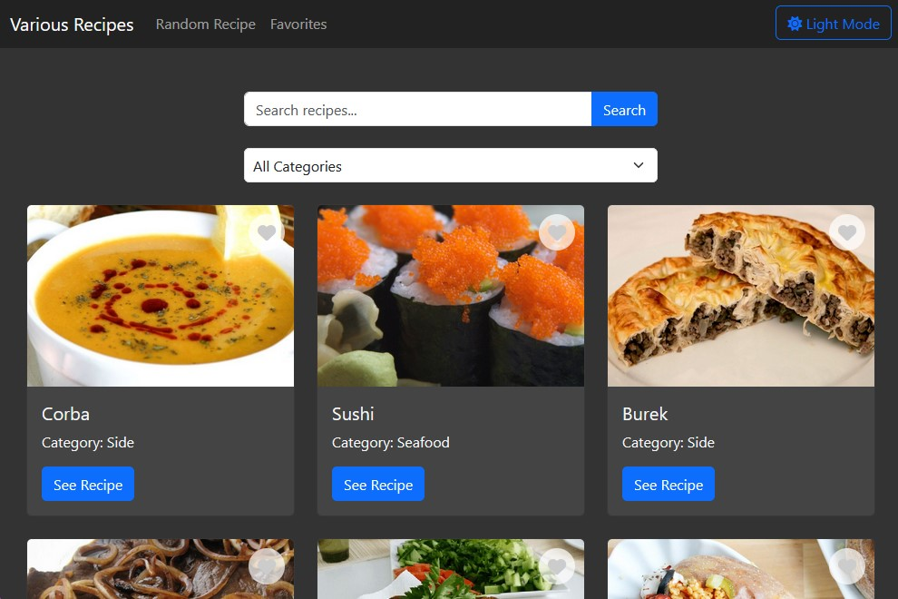

# Various Recipes

## Overview
Various Recipes is a web application that allows users to explore a variety of recipes, filter them by categories, and add their favorite recipes to a favorites list. The application provides an intuitive and user-friendly interface to enhance the culinary experience.

## Features
- Browse a variety of recipes.
- Filter recipes by categories.
- Add recipes to your favorites list for quick access.
- Responsive design with light and dark mode options.

## Screenshot


## Live Demo
Check out the live demo of the project: [Various Recipes](https://AlexsanderMe.github.io/various_recipes-web/)

## API Integration
This project makes use of the [TheMealDB API](https://www.themealdb.com/api.php) to fetch recipe data. The API provides a wide range of recipes with detailed information, including ingredients, instructions, and images.

### Example API Usage
- Fetch a random recipe:
    ```javascript
    fetch('https://www.themealdb.com/api/json/v1/1/random.php')
        .then(response => response.json())
        .then(data => console.log(data));
    ```
- Search for a recipe by name:
    ```javascript
    fetch('https://www.themealdb.com/api/json/v1/1/search.php?s=Arrabiata')
        .then(response => response.json())
        .then(data => console.log(data));
    ```
- Filter recipes by category:
    ```javascript
    fetch('https://www.themealdb.com/api/json/v1/1/filter.php?c=Seafood')
        .then(response => response.json())
        .then(data => console.log(data));
    ```

## Installation

### Steps
1. Clone the repository:
    ```sh
    git clone https://github.com/AlexsanderMe/various_recipes-web.git
    ```
2. Navigate to the project directory:
    ```sh
    cd various_recipes-web
    ```
3. Open `index.html` in your web browser.


## Project Structure
```
various-recipes/
│
├── css/
│   └── styles.css
│
├── js/
│   ├── api.js
│   ├── app.js
│   └── ui.js
│
├── screenshots/
│   └── interface.jpg
│
└── index.html
```

- **css/styles.css:** Contains the styles for the application.
- **js/api.js:** Handles API requests and data fetching.
- **js/app.js:** Manages the core logic of the application.
- **js/ui.js:** Manages the user interface interactions and DOM manipulations.
- **screenshots/interface.jpg:** Screenshot of the application interface.
- **index.html:** Main HTML file for the application.

## License
This project is licensed under the MIT License. See the [LICENSE](LICENSE) file for more details.
